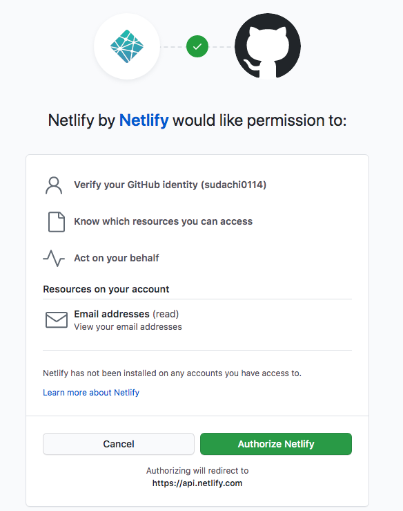
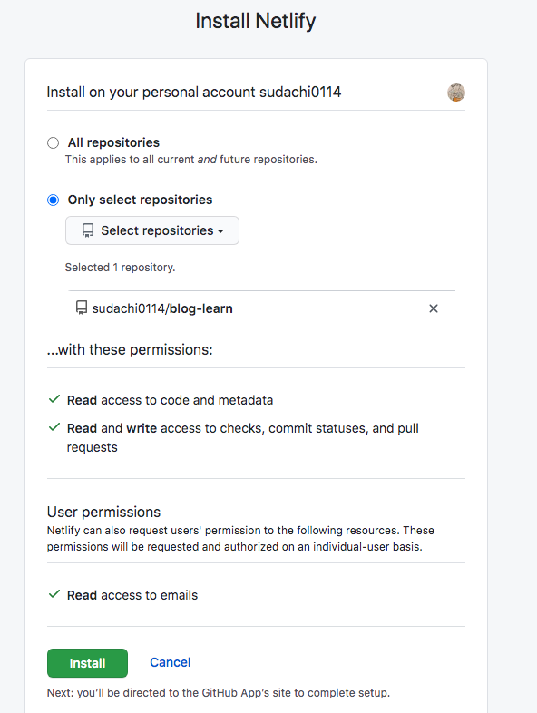
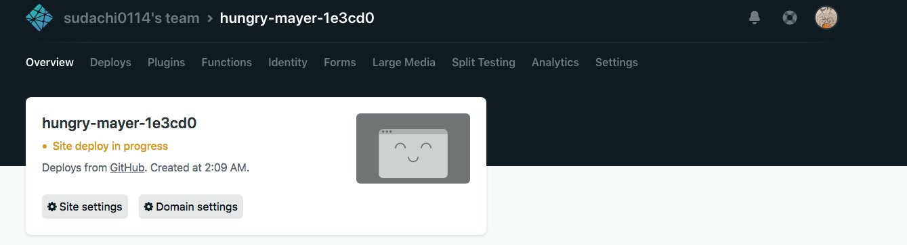
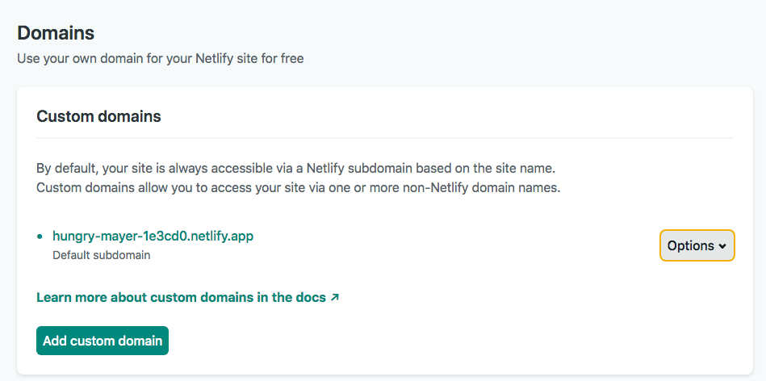
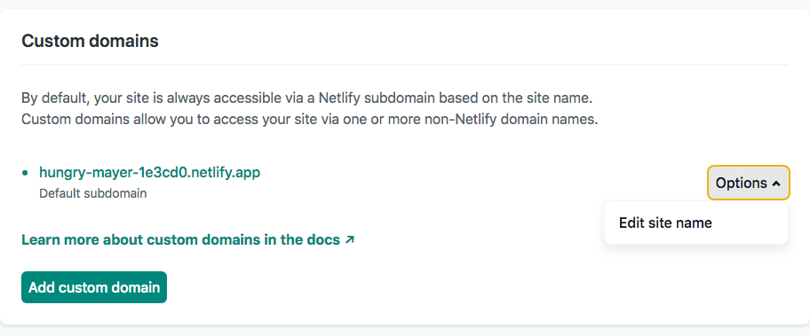
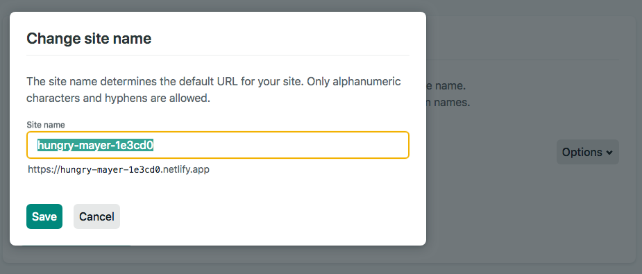

## Netlify に deploy する方法

せっかく blog を作ったので、公開したいですよね。私はしたいです。

今回は、`Netlify` にアップロード (デプロイ) することにしました。

理由としては、主に以下の通りです。

* Netlify が公式に Hugo を推奨している
* Help (Qiita や、他の方のブログ記事) が豊富

技術選定などをするにあたって、これらの観点は私もよく考える点ですね。

### 0. GitHub に登録しよう
まずは、GitHub にリポジトリとして登録しましょう。

Netlify は、 GitHub の (指定の branch の) 変更を見て、デプロイしたサイトの更新をしてくれます。
これにより、 CD (Continus Delevery) 環境を作ることができます。嬉しいですね。


### 1. 設定ファイルを作成

設定は `my-blog/netlify.toml` (プロジェクト直下) に作成します。

基本的には [Hugo 公式の Netlify deploy サポートページ](https://gohugo.io/hosting-and-deployment/hosting-on-netlify/#configure-hugo-version-in-netlify) にテンプレがあるので、これを利用します。

主に変えるところは (私が変えたところ) は、以下の2点です。

1. hugo のバージョン
2. build 時のコマンドに theme を追加

変更後のものを貼っておきます。

```netlify.toml
[build]
publish = "public"
command = "hugo --theme=learn --gc --minify"

[context.production.environment]
HUGO_VERSION = "0.74.3"
HUGO_ENV = "production"
HUGO_ENABLEGITINFO = "true"

[context.split1]
command = "hugo --gc --minify --enableGitInfo"

[context.split1.environment]
HUGO_VERSION = "0.74.3"
HUGO_ENV = "production"

[context.deploy-preview]
command = "hugo --gc --minify --buildFuture -b $DEPLOY_PRIME_URL"

[context.deploy-preview.environment]
HUGO_VERSION = "0.74.3"

[context.branch-deploy]
command = "hugo --gc --minify -b $DEPLOY_PRIME_URL"

[context.branch-deploy.environment]
HUGO_VERSION = "0.74.3"

[context.next.environment]
HUGO_ENABLEGITINFO = "true"
```

* hugo のバージョンに関しては `hugo version` によって知ることができます

例: 私の環境
```
$ hugo version
Hugo Static Site Generator v0.74.3/extended darwin/amd64 BuildDate: unknown
```

`v0.74.3` の部分ですね。
Hugo のテンプレを見て、数字の部分だけ (`v` とか `/extended` とかは除きました) にしました。

4箇所 (くらい, たぶん) あるので、変更してきます。(なんとか 1つ変更するだけで良くならないかなあ...)


* 次に `theme` に関してですが

```netlify.toml
[build]
publish = "public"
command = "hugo --theme=learn --gc --minify"
```

この部分の `command` で指定します。

`--theme` のパラメータとして `my-blog/theme/{テーマ名}` に保存した「テーマ名」に基づいた名前を渡しましょう。


### 2. Netlify への登録
netlify に signup します。

GitHub アカウントが使ええるので、これで登録してしまうのがもっとも早くて簡単かなと思います。

登録すると、以下のような画面が初期状態で出てくるかと思います。


上図、オレンジ枠部分の `New site from GitHub` を選択します。


今回は GitHub から (を使って) デプロイ (管理) するので、
再び、オレンジ枠部分の `GitHub` を選択します。

すると Authorize 画面が出てくると思うので、よろしければ認可してしまいます。



公開する repository や branch を Netlify に登録します。




さて、ここでポップアップ (って言うんでしたっけ?) が閉じると思います。
signup したあとのページが、初めて deploy された site の表示になるかと思います。



もし、ならなければ、reload などしてみると現れるかもしれないです。
(私も最初出てこなくて、焦って再読み込みしたら見られるようになりました...)


サイトのドメイン名ですが、「腹ペコ・マイヤー」とかになっていて、たぶん語群の中からランダムに決定されているんだと思います...

[Netlify 公式ヘルプ](https://docs.netlify.com/domains-https/custom-domains/#definitions) を見ると、ある程度のカスタムは無料枠でできるようです。

`[name-of-your-site].netlify.app` のように `.netlify.app` につながるようにしたらいいみたいです。

以下、変更方法を記載します。

まず、ここを見ます。



edit を選択します。



変更して save すれば完了です



## Links

* [HugoとNetlifyで静的サイト構築するメモ(themeはsubmoduleを利用)](https://qiita.com/jrfk/items/4c6df87ca72a76e30224)
* [Hugo - Host on Netlify](https://gohugo.io/hosting-and-deployment/hosting-on-netlify/#configure-hugo-version-in-netlify)
* [my-blog repository](https://github.com/sudachi0114/blog-learn)
* [my-blog front-page](https://sudachi0114-blog.netlify.app/)