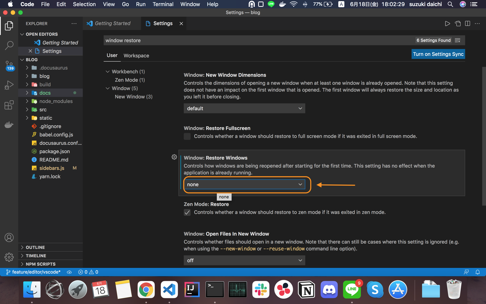

<!-- date: 2021/06/18 -->

# VSCode をいつも新しいウィンドウで起動する

VSCode を使っていると、前回まで使っていたフォルダが記憶されていることがある。

VSCode をいつも新しいウィンドウで起動できる設定を行う。

## 設定方法

以下の2点を設定する必要がある。

1. `window.openWithoutArgumentsInNewWindow` を `on` にする

プロセスが残っているとき、前回のフォルダを記憶しないでウィンドウを起動する設定。

2. `window.restoreWindows` を `none` にする

新しく VScode を起動し直すときに、まっさらなウィンドウで起動するための設定。

新しく VSCode を起動する」とは、プロセスが立ち上がっていないという意味で
Mac でいう、「Command-q で終了した後に、立ち上げる」みたいな状況をさします。

### Setting からの設定

* まず、VSCode を起動し `Settings` を開きます。

---

* `1. window.openWithoutArgumentsInNewWindow: on` の設定を行います。

* 上の方に検索窓があるので `window.openWithoutArgumentsInNewWindow` の名を参考に検索します。

* 設定したい対象の項目が見つかったら `on` にします。

* `on` になったら設定完了です。

---

* 次に `2. window.restoreWindows: none` の設定を行います。

* 同じく、検索窓から `window.restoreWindows` で検索します。

* 設定したい対象の項目が見つかったら `none` にします。

* `none` になったら設定完了です。

## 参考
* [VSCode起動時に前回のフォルダを開かない設定にする](https://qiita.com/yanchi4425/items/dd05109ad88e356e57df)
